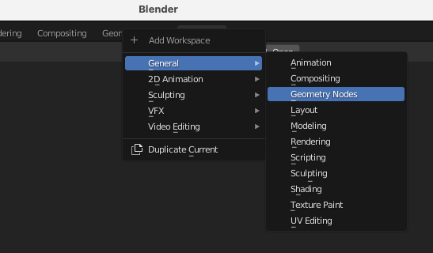
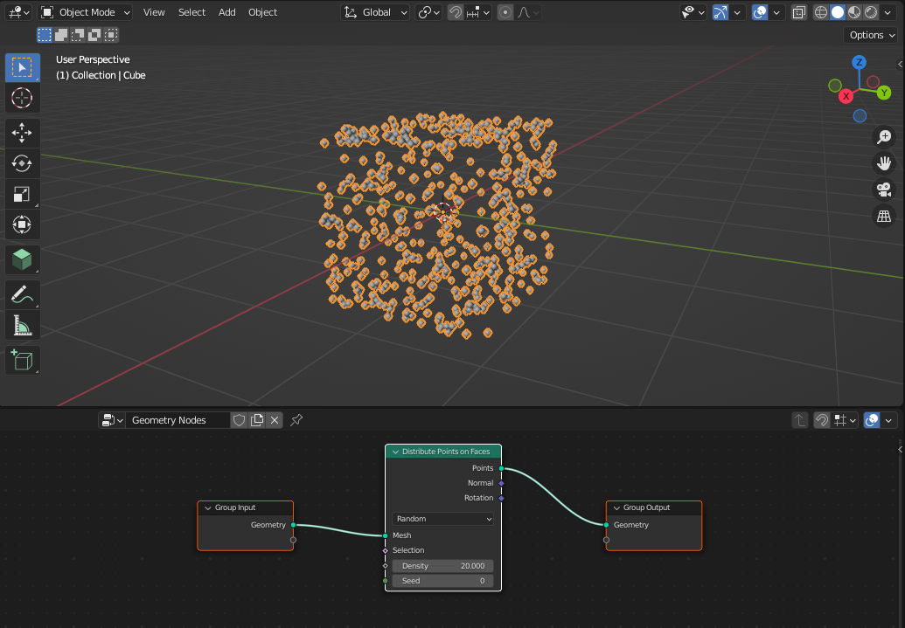
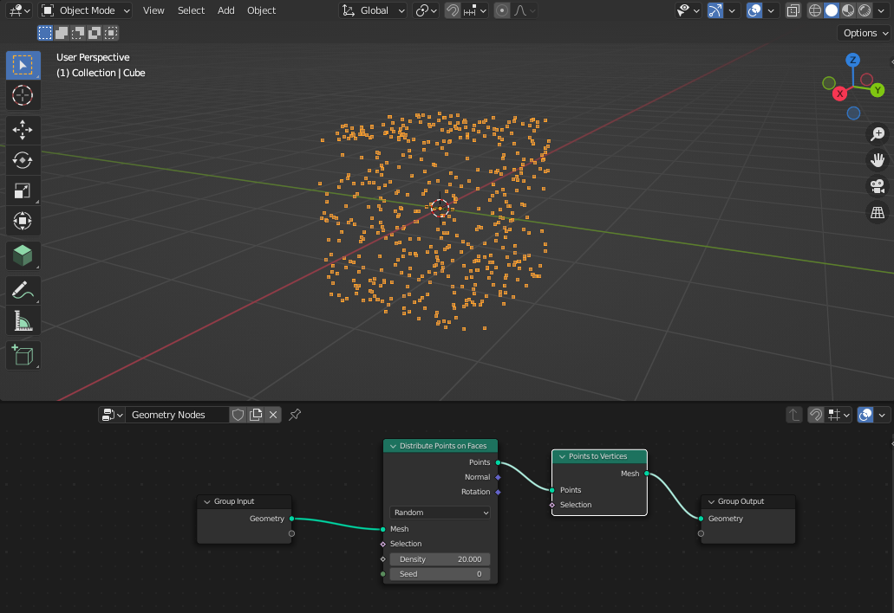
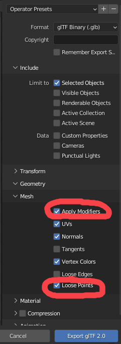

# Blender to point cloud

This is a short guide on how to generate a point cloud out of one or more [blender](https://www.blender.org/) objects. The point cloud is exported in [GLB](https://registry.khronos.org/glTF/specs/2.0/glTF-2.0.html) format.

## To see a point cloud on Blender
- If it does not exist, add a new, **Geometry nodes** workspace.

- In the geometry nodes editor, create a new modifier with a new geometry node group.
- Add a node **Mesh to points** to convert vertices to points, or add a node **Distribute points on faces** to create a sort of point cloud (`Shift + A` shortcut, or **Add** tab in the editor). The parameters of the node can be
adjusted as seen fit.

- Add a node **Set point radius** if you need to have control over the points size.

## To export a point cloud in GLB format

Before being able to export in GLB format as a point cloud (as opposed to a standard geometry), we need to:

- add a **Points to vertices** node in the geometry nodes editor, before the output node. Otherwise no points will be saved.

- In the save file parameters, select which objects to save depending on your needs.
- It is important to check **Loose points** and **Apply modifiers** in the mesh options.

